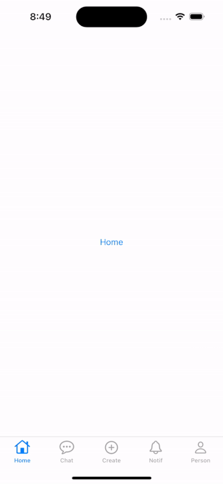

## Work in progress!

Client MVP Features

| Feature   | Status  |
|-----------|---------|
| Login     | backlog |
| Signup    | backlog |
| Home      | backlog |
| Subreddit | backlog |

Backend MVP Features

| Endpoint               | Status |
|------------------------|--------|
| Login                  | done   |
| Register               | done   |
| Create Subreddit       | done   |
| Join Subreddit         | done   |
| Create Post            | done   |
| Create Post Attachment | done   |
| Vote Post              | done   |
| Private Post List      | done   |
| Public Post List       | done   |

## Target Platform

1. Android - Views
2. iOS - programmatic UIKit
3. Web (WASM) - removed
4. Server (JVM) - Ktor

## :sparkling_heart: iOS Skeleton Done :sparkling_heart:


## Challenges

1. The navigation in the WASM JS target for Compose is currently inadequate, as it does not support the back and forward
   buttons of web browsers.
2. Variable-width fonts are not yet supported in the WASM JS target. Here is
   the [link to the issue](https://youtrack.jetbrains.com/issue/CMP-4635/Wasm-Variable-fonts-are-displayed-as).
3. The Compose Multiplatform preview still doesn't work consistently; it sometimes functions and other times does not,
   atleast that's my experience using the Fleet IDE.

## Recommendation

1. Not a fan of the web target since it uses Canvas to display the UI (Might remove the web target)

## Configuration

Update shared/src/commonMain/

```
// TODO: This is going to be migrated to BuildKonfig in the future
object Constants {
    val SERVER_PORT = 8080
    val SUPABASE_URL = ""
    val SUPABASE_KEY = ""
    val JWT_USER_AUTH = ""
    val JWT_SECRET = ""
    val JWT_ISSUER = ""
    val JWT_AUDIENCE = ""
    val JWT_REALM = ""
    val JWT_CLAIM_USERNAME = ""
    val JWT_CLAIM_USER_ID = ""
    val FALLBACK_ERROR_MESSAGE = ""
}
```

## Popular tools used

1. Koin - dependency injection
2. kotlinx-datetime - date and time utility
3. kotlinx-serialization - serialization and deserialization
