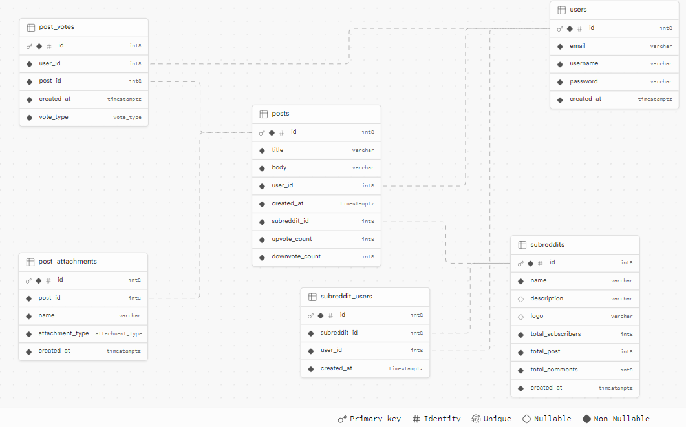

1. Create a file
   in `Create a file shared/src/commonMain/kotlin/link/limecode/reddit/lite/config/CommonConstants.kt`
   and fill the config accordingly

   ```
   // TODO: This is going to be migrated to BuildKonfig in the future
   object Constants {
       // the port of the ktor server
       val SERVER_PORT = 8080
   
       // your supabase credentials
       val SUPABASE_URL = ""
       val SUPABASE_KEY = ""
   
       // your jwt config
       val JWT_USER_AUTH = ""
       val JWT_SECRET = ""
       val JWT_ISSUER = ""
       val JWT_AUDIENCE = ""
       val JWT_REALM = ""
       val JWT_CLAIM_USERNAME = ""
       val JWT_CLAIM_USER_ID = ""
   
       // fallback messages
       val FALLBACK_ERROR_MESSAGE = ""
       val TIMEOUT_ERROR_MESSAGE = ""
   
       // url used by the clients
       val CLIENT_BASE_URL = ""
   }
   ```

2. Setup your supabase schema (maybe I'll provide a query in the future)

   

3. Run a target


